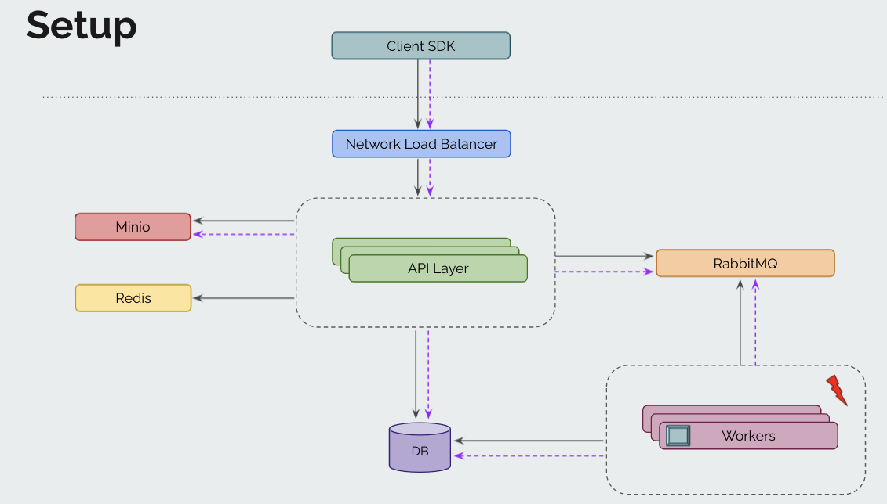

# eKYC Client
___


## Features

- Signup a new API client to get access and secret keys
- Upload images with metadata
- Perform face matching between two image ids to get the face match score
- Perform optical character recognition (OCR) on images
- Reporting - generate client wise daily/weekly/monthly reports for billing purposes via cron jobs


## Architecture




## Assumptions

- Actural ML models not used for OCR and face match.
- Fake KYC data is generated and used

## Requirements

- go version >= 1.17
- docker
- docker-compose

## Usage

Clone the repository using:
```bash
git clone github.com/mkrs2404/eKYC.git
```

Run following commands in the root directory:

- Run
```
make host=<hostname> db=<db_name> user=<username> pwd=<password> port=<db_port> server=<IP:Port> run
```

- Test
```
make test
```

- Clean workspace
```
make clean
```